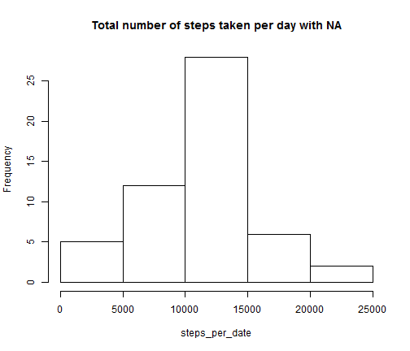
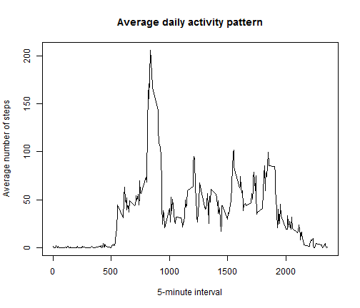
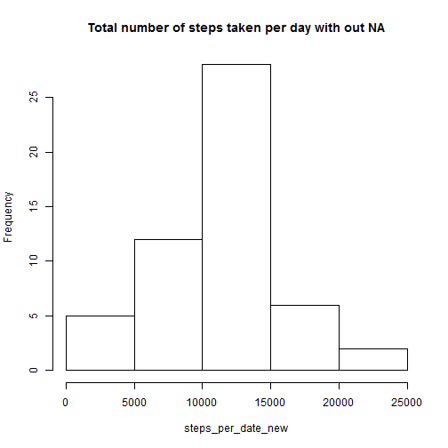

# Assignment-1
========================================================


```r
activity = read.csv("activity.csv", header = TRUE)
dates <- unique(activity$date)
number_of_date <- length(dates)
steps_per_date <- c(length(number_of_date))
mean_per_date <- double(length(number_of_date))
median_per_date <- double(length(number_of_date))
for (i in 1:number_of_date) {
    steps_per_date[i] <- sum(activity$steps[activity$date == dates[i]])
    mean_per_date[i] <- mean(steps_per_date[i])
    median_per_date[i] <- median(steps_per_date[i])
}
```


```r
def_5_min <- unique(activity$interval)
avf_per_5_min <- double(length(def_5_min))
for (i in 1:length(def_5_min)) {
    avf_per_5_min[i] <- mean(activity$steps[activity$interval == def_5_min[i]], 
        na.rm = TRUE)
}
```


```r
dataset = activity
counter = as.integer(0)
for (i in 1:length(dataset$steps)) {
    if (is.na(dataset$steps[i])) {
        for (j in 1:length(def_5_min)) {
            if (dataset$interval[i] == def_5_min[j]) {
                dataset$steps[i] <- avf_per_5_min[j]
                counter <- counter + 1
            }
        }
    }
}
steps_per_date_new <- c(length(number_of_date))
mean_per_date_new <- double(length(number_of_date))
median_per_date_new <- double(length(number_of_date))
for (i in 1:number_of_date) {
    steps_per_date_new[i] <- sum(activity$steps[activity$date == dates[i]])
    mean_per_date_new[i] <- mean(steps_per_date[i])
    median_per_date_new[i] <- median(steps_per_date[i])
}
```


You can also embed plots, for example:


```r
hist(steps_per_date, main = "Total number of steps taken per day with NA", right = FALSE)
```

 


```r
plot(def_5_min, avf_per_5_min, main = "Average daily activity pattern", xlab = "5-minute interval", 
    ylab = "Average number of steps", type = "l")
```

 


```r
hist(steps_per_date_new, main = "Total number of steps taken per day with out NA", 
    right = FALSE)
```

 


